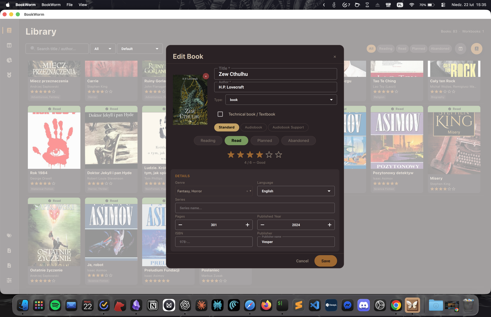
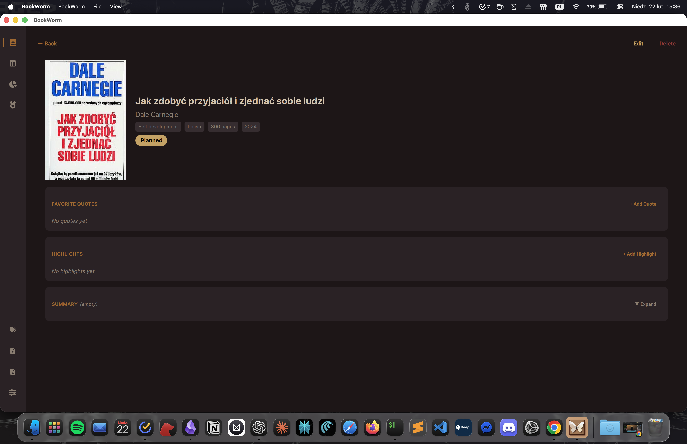
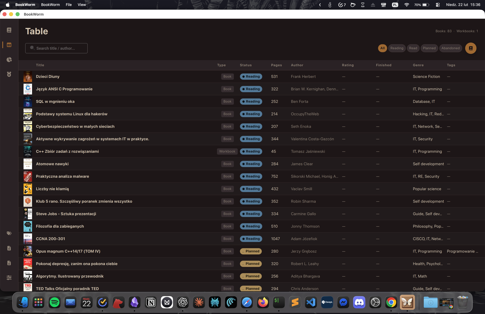
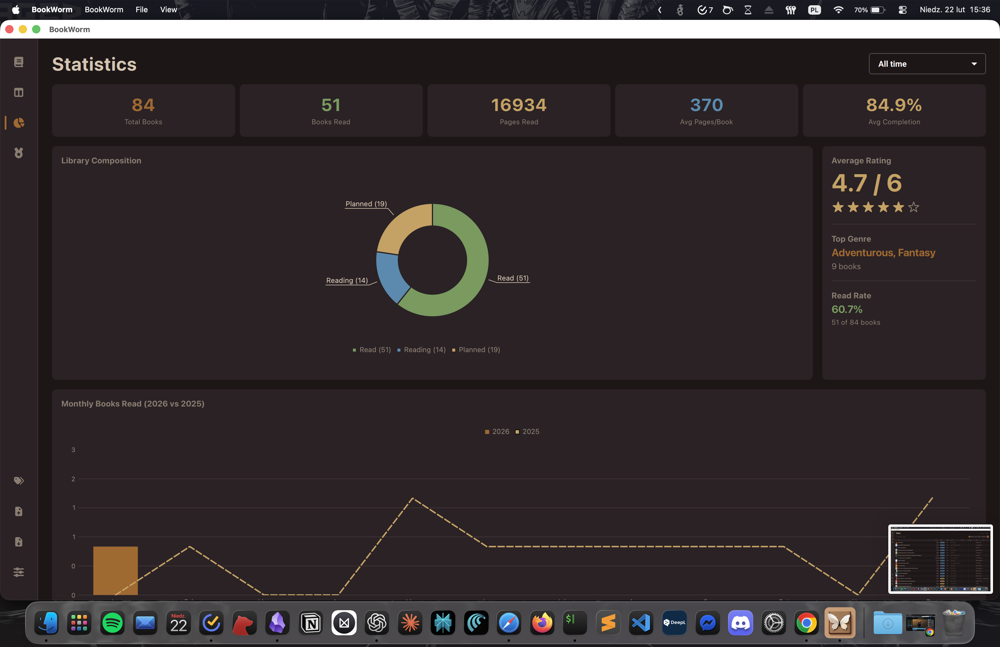
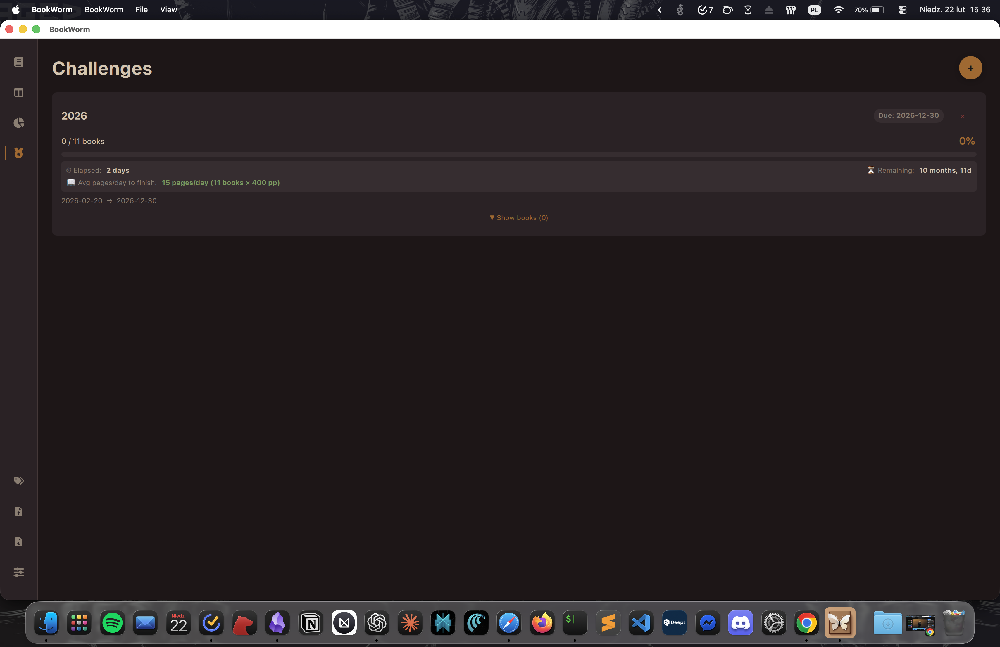

<p align="center">
   
</p>
<h1 align="center">BookWorm — Personal Library Manager</h1>
<p align="center">
  
  
  
  
  
  
</p>

---

## Description

BookWorm tracks a personal library: what you are reading, what you have read,
and what is next. It is a **Qt 6 (C++/QML) macOS application** backed by
PostgreSQL — and, if you want it, a small server of your own and an iPhone app
that moves the page count from wherever you happen to be reading.

The desktop application is the product. The other two parts are optional and
exist only so a second device can exist; with sync switched off, BookWorm never
touches the network and never mentions that it could.

**Keywords:** *book tracker, reading list, Qt6, QML, PostgreSQL, desktop app, self-hosted sync, iOS*.

## Install — pick one

| | **Desktop only** | **Full environment** |
| --- | --- | --- |
| You get | The complete application on one Mac | The same, plus your own server and the iPhone app, syncing both ways |
| Needs | Homebrew, Qt, PostgreSQL | The above, plus a VPS (or a local Node) and Xcode |
| Network | None. Ever. | Your server, over TLS |
| Time | ~15 min | ~1 h |
| Guide | **[INSTALL-DESKTOP.md](docs/INSTALL-DESKTOP.md)** | **[INSTALL-FULL.md](docs/INSTALL-FULL.md)** |

Starting with the desktop and adding the rest later costs nothing — the full
guide begins from exactly that state.

## Documentation

| Document | What is in it |
| --- | --- |
| [docs/ARCHITECTURE.md](docs/ARCHITECTURE.md) | How the three parts fit together, and the eight rules that keep them honest |
| [docs/API.md](docs/API.md) | The HTTP contract, written so a client can be built without reading the server |
| [docs/INSTALL-DESKTOP.md](docs/INSTALL-DESKTOP.md) | Desktop install, and the Qt PostgreSQL driver step that is easy to miss |
| [docs/INSTALL-FULL.md](docs/INSTALL-FULL.md) | Server, sync and the iPhone app |
| [server/deploy/RUNBOOK.md](server/deploy/RUNBOOK.md) | Provisioning, upgrading and operating the VPS |
| [ios/README.md](ios/README.md) | Building and signing the iPhone app from a clean checkout |

### Features

**Library**

- **Five views**: Library (card grid), Table (spreadsheet), Statistics, Challenges, Series.
- **Book CRUD** with cover images, ratings, genres, tags, series, ISBN, publisher.
- **Item types**: book, article, newspaper, magazine, comic, manga, thesis, workbook, other.
- **Reading progress** with a per-book progress bar, and a priority flag that pins a book to the top.
- **Audiobook mode**: audiobook or audiobook-supported, marked on the card.
- **Rating** 1–6 stars, available once a book is finished.
- **Quotes, highlights, summaries and reviews** per book; Markdown export of all of it.
- **Reading challenges** by books, pages, or pages per day, over a period or to a date.
- **Statistics**: totals, averages, genre distribution, year-on-year charts, streaks, a pages-per-day chart, weekday distribution, completion projections and an activity heatmap.
- **Reading sessions**, recorded automatically whenever progress moves — this is what the streaks and the heatmap are built from.
- **Undo delete**, **CSV import/export**, **three themes**, **English/Polish** with system detection.

**Backup**

- One ZIP holding a full database dump, every cover image and a manifest, verified before it is written and produced through a temporary file so a failed run cannot destroy the last good one. Manual, or on an interval.
- Restore trial-loads the archive into a scratch database first, shows the book count on both sides, takes a safety backup of what it is about to replace, and asks you to type `RESTORE`.

**Sync** *(optional)*

- Off by default and silent about it. Point it at your own server in Settings.
- The whole library travels, covers included; images move by content hash, so the same edition is stored once.
- Automatic: at launch, every two minutes, three seconds after an edit, when the window comes forward, and at shutdown. A button in the header does it on demand.
- Neither side can overwrite newer data with older — both apply the same rule to the same timestamp.

**Server** *(optional)*

- One account, yours. No registration endpoint, and nothing multi-tenant to get wrong.
- Installed by a single command on an Ubuntu VPS: systemd, Caddy terminating TLS, PostgreSQL on loopback, backups armed.
- **Backups on a schedule you choose**, with retention by count — `backup-config.sh set-interval 6h`, `set-keep 30`, `at_now`. Each dump is paired with its cover archive and deleted with it, and rotation happens only after a successful run, so a failing job can never remove the last good backup.

**iPhone** *(optional)*

- One screen: the books you are reading, each with a slider.
- A page change is a proposal until you confirm it, so brushing the control while scrolling cannot rewrite your history.
- Works offline — writes are queued on disk before they are attempted and flushed when there is signal.

## Technicalities

| Component | Details |
|---|---|
| **Language** | C++17 + QML |
| **Framework** | Qt 6.10+ (Homebrew) |
| **Qt Modules** | Core, Sql, Qml, Quick, QuickControls2, Charts, ChartsQml, Widgets |
| **Database** | PostgreSQL 16+ |
| **Build system** | CMake 3.21+ |
| **Platform** | macOS (Apple Silicon / Intel) |
| **Server** *(optional)* | Node 24 + Fastify, PostgreSQL 16, Caddy |
| **iPhone** *(optional)* | Swift 6 + SwiftUI, iOS 17+, no third-party packages |
| **Theme** | Material Dark / Light |

### Architecture

```
User --> QML Signal --> BookController (Q_INVOKABLE) --> DatabaseManager --> PostgreSQL
                                                     |
                                       BookModel::setBooks() --> QML bindings --> UI
```

- **DatabaseManager** — Singleton. PostgreSQL connection, schema init with idempotent migrations, all CRUD operations.
- **Book** — Plain struct (25 fields), serialization via `toVariantMap()` / `fromVariantMap()`.
- **BookModel** — `QAbstractListModel` with 23 roles, registered as `QML_ELEMENT`.
- **BookController** — QML bridge: filtering, search, CSV import/export, tag/quote/challenge management.
- **StatisticsProvider** — Computes reading stats exposed as QML properties.
- **SyncManager** — Everything network, and nothing at all until sync is configured.
- **BackupManager** — ZIP backup and verified restore.
- **Theme.qml** — Singleton managing colors, fonts, spacing, and translations via `tr()`.

A fuller account of the whole system — including how the desktop and the phone
deliberately talk to the server in different ways — is in
[docs/ARCHITECTURE.md](docs/ARCHITECTURE.md).

### Project Structure

The repository is a monorepo. Each top-level directory is one codebase with its
own toolchain, its own tests and its own CI workflow.

```
BookWorm/
├── README.md
├── docs/                             ARCHITECTURE, API, both install guides
├── desktop/                          Qt6 C++/QML application — CMake
│   ├── qml/                          Main window, theme, components
│   ├── src/
│   │   ├── database/                 Singleton PostgreSQL manager
│   │   ├── models/                   Book struct, QAbstractListModel
│   │   ├── controllers/              QML bridge
│   │   ├── statistics/               Stats queries
│   │   ├── sync/                     API client, sync manager, Keychain
│   │   └── backup/                   ZIP backup and restore
│   └── sql/init.sql                  Reference schema
├── server/                           Node + Fastify API — npm
│   ├── src/                          auth, books, collections, covers, sync
│   ├── migrations/                   node-pg-migrate
│   ├── test/                         95 tests against a real PostgreSQL
│   └── deploy/                       install.sh, systemd unit, RUNBOOK
└── ios/                              SwiftUI iPhone app — Xcode
    ├── BookWormProgress/             The app: views, Keychain, covers
    └── BookWormKit/                  Logic + tests, runnable without a simulator
```

## Screenshots

<p align="center">
   
   <br>
   <b>Fig. 1</b> <i>Library view — card grid with status indicators</i>
</p>

<p align="center">
   
   <br>
   <b>Fig. 2</b> <i>Add / edit book form</i>
</p>

<p align="center">
   
   <br>
   <b>Fig. 3</b> <i>Book details — quotes, highlights, summary & review</i>
</p>

<p align="center">
   
   <br>
   <b>Fig. 4</b> <i>Table view — spreadsheet layout</i>
</p>

<p align="center">
   
   <br>
   <b>Fig. 5</b> <i>Statistics — charts & reading analytics</i>
</p>

<p align="center">
   
   <br>
   <b>Fig. 6</b> <i>Reading challenges — goals & progress tracking</i>
</p>

## Author

**Jakub SQTX Sitarczyk**

Copyright &copy; 2024–2026. All rights reserved.
